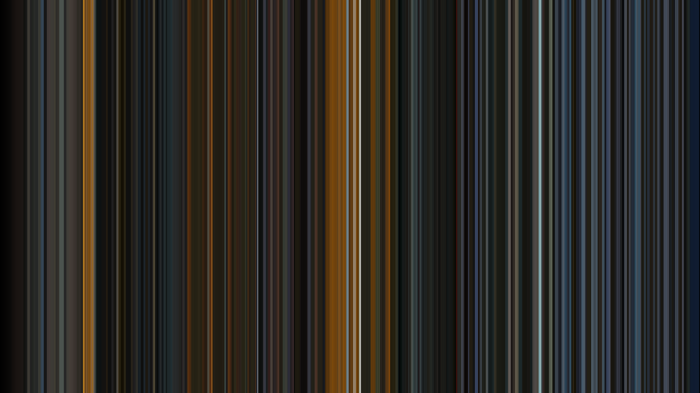
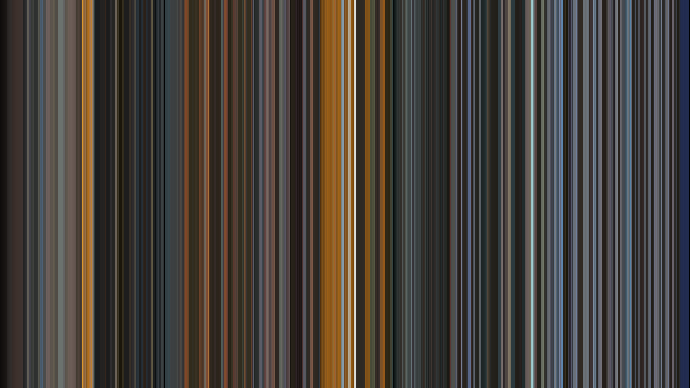
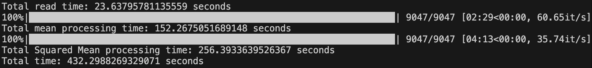

## Intro

I started my exploration of movie barcodes in my [last post](/posts/barcode/barcode01) by making a simple barcode of Wu-Tang's classic "Triumph" music video: 

[](triumph_mean.png)

I used FFMPEG to load the [YUV](https://en.wikipedia.org/wiki/YCbCr) video file into Python as an [RGB](https://en.wikipedia.org/wiki/RGB_color_model) NumPy array and then took the mean value of the red, green, and blue values of each frame and sequenced them with the first frame on the left to the last frame on the right of the output image.

This worked to create a simple barcode, but the barcode came out a little dark when compared to the video. This is because my code didn't take into account the nonlinear nature of how the video file is stored. Over the next few posts, I'm going to investigate how video files are stored and look at more accurate ways to calculate average color.


## Square Averaging

Let's start investigating how to take a better color average by reviewing [this article by Sighack][1] and [the video it references from Minute Physics][2]:



These sources detail how a pixel in an image file is effectively the square root of the light level perceived by humans. The values are stored darker than they are perceived, so you will end up with a darker average than desired when you average on the stored values.

To average correctly, you will need to square the value before taking the average so that the averaging is being done at the perceptual level. To get the average value back to store in the image file, we will need to do the inverse operation by taking the square root after averaging. We will do this for red, green, and blue channel in an RGB image.

Let's write that in equation form. Assume each frame is an RGB image with \(n\) total pixels where each pixel \(i\) has the value of \( (R_i, G_i, B_i ) \). The average pixel value \( (R_{ave}, G_{ave}, B_{ave} ) \) of a frame is calculated for each color independently: 

\[
\begin{aligned}
R_{ave} = \sqrt{\sum_{i=0}^n R_i^2} \\
G_{ave} = \sqrt{\sum_{i=0}^n G_i^2} \\
B_{ave} = \sqrt{\sum_{i=0}^n B_i^2}
\end{aligned}
\]

The output barcode image will be n_frames wide. Each column of the barcode image will be equal to the average value of the respective frame.


## Code Outline

The meat of today's code is very similar to the simple code. I'll just square the values of every frame, take the average, and then take the sqrt before converting back to an image to save. I'd like to compare the timing of the simple mean to the squared mean so I'm going to run both sets of code today.

I'm also going to use the handy [tqdm](https://tqdm.github.io/) library to show the progress of my processing loops. You can install it with conda:

```
conda install tqdm
```

And here's the outline of the code:

* Import packages
* Get video info using ffmpeg's probe
* Convert video to NumPy RGB array using ffmpeg
* Process mean barcode:
    * Initialize Mean barcode image as NumPy array of all zeros. Width = number of frames. Height is calculated for 16:9 aspect ratio.
    * Go frame by frame, calculate the average value of each color with NumPy's "mean" method
    * Set the column of the barcode image to that color
    * Convert the barcode image to a Pillow Image object and save to file
    * Display processing time
* Process squared mean barcode:
    * Initialize Squared Mean barcode image. Same dimensions as Mean barcode image.
    * Go frame by frame, take square of frame value, then take the average value of each color with NumPy's "mean" method
    * Set the column of the barcode image to that color
    * Take square root of completed image, then convert to Pillow Image object and save to file
    * Display processing time


## Code

Here's the full code:




## Results

Here's the Squared Mean barcode:

[](triumph_mean_sq.png)

And here's the Mean barcode to compare:

[](triumph_mean.png)

The Squared Mean barcode is definitely brighter. It's easier to distinguish changes in color during the darker scenes (take note of  the darker scenes about a quarter of the way through the video). The brighter scenes also appear brighter and there appears to be better contrast between the bright and dark scenes. I find this a much more appealing image.

Here's a screenshot of the console output showing processing time and the tqdm progress bar:

[](processing_time.png)

It took about 256 seconds to process the Squared Mean image vs. about 152 seconds for the Mean image. That's about 1.7 times longer. I'll definitely need to do some code optimization in the future when going to longer videos. 

## Next Steps

I think this methodology created a more pleasing barcode image of Triumph but there's more to learn. Pay attention to this note in the video at 2:01: "The actual root used in this process can range between 1.8 and 2.2 and is called the 'gamma' value". Let's look at our video file and determine what 'gamma' value to use next time.

-- Teamster Sub


[1]: https://sighack.com/post/averaging-rgb-colors-the-right-way "Averaging RGB Colors the Right Way"
[2]: https://www.youtube.com/watch?v=LKnqECcg6Gw "Computer Color is Broken"
